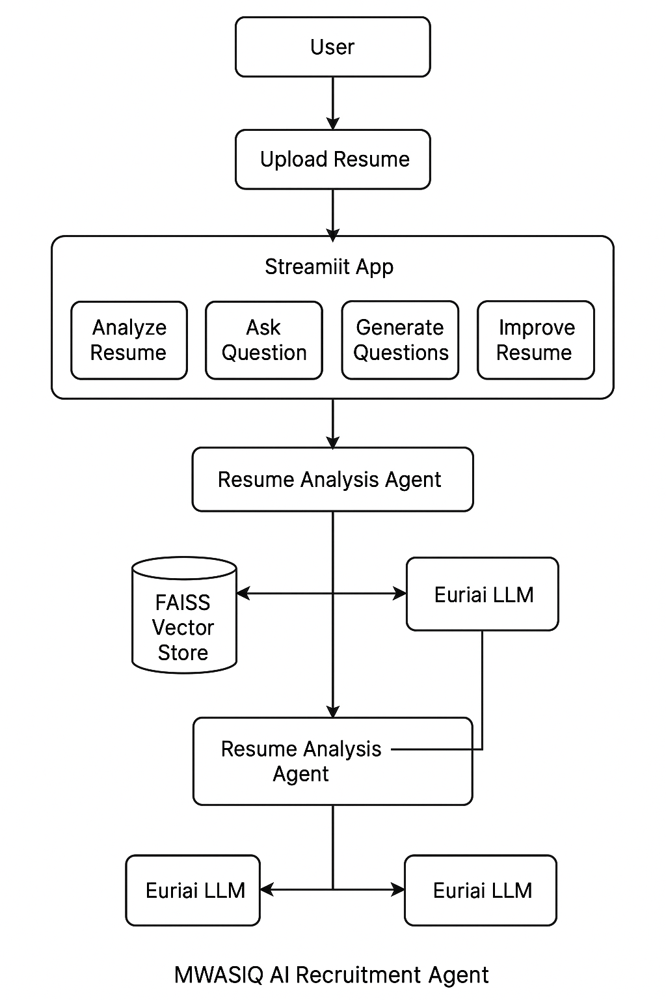

# 🚀 MWASIQ AI Recruitment Agent

An AI-powered recruitment assistant for **resume analysis**, **resume Q&A**, **interview preparation**, and **resume improvement suggestions**. Built with **Streamlit**, **LangChain**, and **Euriai APIs**, this app provides an interactive dashboard to analyze resumes and generate actionable insights.

---

## 📦 Features

- 📄 **Resume Analysis**: Analyze uploaded resumes and rate skill proficiency.
- 💬 **Resume Q&A**: Ask questions about your resume and get instant AI answers.
- 🎯 **Interview Questions**: Generate technical, behavioral, and situational interview questions tailored to your resume.
- 📈 **Resume Improvement**: Get AI-powered suggestions for grammar, formatting, and keyword optimization.
- 📝 **Improved Resume**: Generate an improved version of your resume with highlighted skills and roles.

---

## 🚀 Tech Stack

- 🖥️ **Frontend**: Streamlit
- 🧠 **AI Models**: Euriai LLM APIs
- 🔗 **Vector Store**: FAISS (via LangChain)
- 📦 **Libraries**: PyPDF2, LangChain, euriai, FAISS, Streamlit

---

## Workflow



---

## ⚙️ Installation

### Create VENV

```bash
uv venv
```

### Activate VENV

```bash
.venv/Scripts/activate  # Window

.venv/bin/activate  # MAC OS
```

### Library Installation

```bash
uv pip install - r requirements.txt
```

### Run the App

```bash
streamlit run app.py
```

---

### 📁 Project Structure

```bash
├── app.py                  # Main Streamlit application
├── ui.py                   # UI components for Streamlit
├── agents.py               # Resume analysis and AI logic
├── requirements.txt        # Python dependencies
├── README.md               # Project documentation

```

---

## Demo


---


---


---


---


---


---


---


---


---

---

## 📐 High-Level Design (HLD)

### 🏗️ Project: MWASIQ AI Recruitment Agent

#### 🎯 Objective

Build an AI-powered recruitment assistant that allows users to:

- Analyze resumes for skill proficiency.
- Ask questions about their resumes.
- Generate tailored interview questions.
- Get improvement suggestions and an improved resume.

---

#### 🪜 Architecture Overview

```bash
User -> Streamlit UI -> app.py -> agents.py -> Euriai API / FAISS Vector Store
```

---

#### 📦 Major Components

| Component            | Description                                                  |
| -------------------- | ------------------------------------------------------------ |
| **app.py**     | Entry point for Streamlit; handles user flow and logic.      |
| **ui.py**      | Contains all Streamlit UI components and page sections.      |
| **agents.py**  | Core AI logic: Resume analysis, Q&A, improvement, RAG setup. |
| **Euriai API** | LLM API for NLP tasks (via LangChain integration).           |
| **FAISS**      | Vector database for semantic search on resume content.       |

---

#### 🌐 Data Flow

1. User uploads resume (PDF/TXT) & optional JD.
2. `agents.py` extracts text and creates embeddings (FAISS).
3. Euriai LLM answers questions and provides analysis.
4. Results sent to `ui.py` for display in Streamlit tabs.

---

#### ⚙️ External Dependencies

- Euriai LLM APIs
- LangChain (RAG and chaining)
- FAISS (semantic search)
- PyPDF2 (PDF parsing)

---

#### 🔒 Security

- API keys stored securely (via environment variables or sidebar entry)
- Temporary resume files deleted after analysis

## 📐 Low-Level Design (LLD)

### 📁 agents.py

#### Classes

#### ✅ ResumeAnalysisAgent

| Method                             | Description                                              |
| ---------------------------------- | -------------------------------------------------------- |
| `__init__()`                     | Initializes API key, cut-off score, and state variables. |
| `extract_text_from_pdf()`        | Extracts text from PDF using PyPDF2.                     |
| `extract_text_from_txt()`        | Extracts text from TXT files.                            |
| `extract_text_from_file()`       | Determines file type and extracts text accordingly.      |
| `create_rag_vector_store()`      | Creates FAISS vector store from resume text chunks.      |
| `analyze_resume()`               | Orchestrates resume analysis flow.                       |
| `ask_question()`                 | Answers questions about resume content.                  |
| `generate_interview_questions()` | Generates AI-based interview questions.                  |
| `improve_resume()`               | Suggests improvements for grammar, formatting, etc.      |
| `get_improved_resume()`          | Generates an improved resume version.                    |
| `cleanup()`                      | Deletes temporary files after analysis.                  |

---

### 📁 ui.py

#### Functions

| Function                          | Description                                      |
| --------------------------------- | ------------------------------------------------ |
| `setup_page()`                  | Configures Streamlit page title and description. |
| `setup_sidebar()`               | Displays API key input field.                    |
| `create_tabs()`                 | Sets up five functional tabs.                    |
| `display_analysis_results()`    | Shows resume analysis results beautifully.       |
| `resume_qa_section()`           | Allows user to ask questions about their resume. |
| `interview_questions_section()` | Generates and displays interview questions.      |
| `resume_improvement_section()`  | Shows improvement suggestions.                   |
| `improved_resume_section()`     | Provides improved resume and download option.    |

---

### 📁 app.py

#### Flow

1. Setup page and sidebar.
2. Wait for user to upload resume & select role/JD.
3. Trigger analysis in `agents.py`.
4. Render results in `ui.py` tabs.

---

### 🧪 Testing

| Component           | Test Case                                    | Expected Result                   |
| ------------------- | -------------------------------------------- | --------------------------------- |
| Resume Analysis     | Upload PDF resume with valid skills          | Displays skill scores & reasoning |
| Resume Q&A          | Ask "What are my strengths?"                 | Returns strengths from analysis   |
| Interview Questions | Generate 5 technical questions               | Shows 5 AI-generated questions    |
| Improvement         | Select "Formatting" and submit               | Shows formatting suggestions      |
| Improved Resume     | Generate improved resume with "Python" focus | Displays and allows download      |

---

### 🔒 Security Measures

- Temporary files are deleted after session ends (`cleanup()`).
- No sensitive data is logged or persisted.
